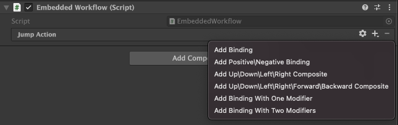
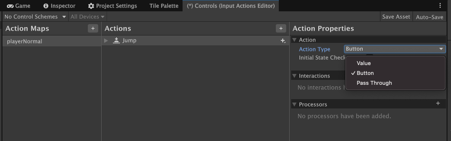
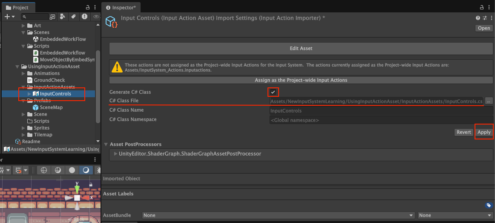
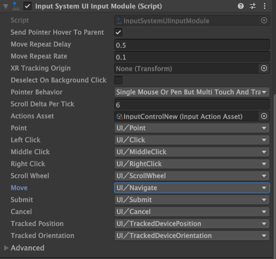

# Better-Input-System  
Project to try and capture complete new input system  

## General info  
New input system for better key bidings in games  
Unity input system can be added by using the id: `com.unity.inputsystem`  
Corresponding setting can be foubd in **Edit** > **Project Settings** > **Player** > **Other Settings** > **Active Input Handling**. If you change this setting you must restart the Editor for it to take effect.  
Namespace to use: `UnityEngine.InputSystem;`  
 
 
There are [3 ways](https://docs.unity3d.com/Packages/com.unity.inputsystem@1.17/manual/Workflows.html) of using the new input system:
- **Directly reading Device States**
	- *Useful for POC*, bad for actual work
	- Works great if you have only one way of getting the input(only keyboard and mouse, or only one type of controller on consoles)
- **Using Actions** 
	- script references Input Action Asset, 
	- useful for work with *fixed input format*
- **Using an Actions Asset and a PlayerInput component**
	- attach callbacks from actions to your scripts
	- script does not need code between input system and your methods
	- useful for work with *key rebinding format*

### Directly reading Device States
This is good for scenarios where you have only on way of getting the input and only on one platform.
We directly access the keyboard or gamepad reference and then try to fetch individual keys and axis values for calculations.
This means, to change an input key binding, we will have to manually go to the script and make changes, this is prone to errors in complex setup.
See [`DirectSyntax.cs`](Assets/NewInputSystemLearning/01_DirectReadingDeviceStates/Scripts/DirectSyntax.cs) for an example of this type of setup.

For input sources like GamePad, we can check the deadzone of the axis to avoid unwanted movements.
This setting is found here: **Project Settings** > **Input System Package** > **Settings** > **Default Deadzone Min/Max**.  
We can chang it by crating an asset : **Project Settings** > **Input System Package** > **Settings** > **Create settings asset**

### Using Actions
#### Using Embedded Actions
This allows a user to create key bindings in the inspector, and the script only holds reference to the result value type. This is ideal if you have a single input Handler script and want to define all input bindings in one place.
This system focuses on defining the type of input action we want to perform, and then binding multiple keys to the action for different platforms. In case of a change needed in future, the bindings can be updated without effecting the code.

This allows us to create an `InputAction` variable that can be used to read input values by binding them to the action.  
This action can be binded to multiple keys, and we can read the value of the action in a unified way.  

- **Add Binding**: Allows us to add a key(keyboard key, gamepad button, etc) to the action, so this key will trigger this action.(`EmbeddedWorkflow.jumpAction`)  
- **Add Positive/Negative Binding**: Allows us to add keys for single axis input, like single axis movement like scrollbar.  
- **Add Up\Down\Left\Right Composite**: Allows us to add keys for 2D axis input, like movement in 2D space.(`EmbeddedWorkflow.moveAction`)
- **Add Binding with one modifier**: Allows us to add keys with modifier keys, like Ctrl+C for copy.
- **Add Binding with two modifiers**: Allows us to add keys with two modifier keys, like Ctrl+Shift+S for save as.

This `InputAction` cannot work directly, we need to enable it first by calling `action.Enable()` in the script. Similarly, we have to disable it by calling `action.Disable()` when it is no longer needed to avoid errors.  
The Action can be subscribed to by 3 events: `Started`(on key press), `Performed`(first frame where key being pressed), and `Canceled`(on key released).  
- `Started`: runs when the action starts, e.g. when a button is pressed down or when a joystick is moved.
- `Performed`: runs when the action is performed, e.g. when a button is registered as pressed or when the joystick moves.
- `Canceled`: runs when the action is canceled, e.g. when a button is released. 

So, `Started` and `Performed` are played in same frame, but `Started` is called before `Performed`.  
 
Each Subscribed method gets the context of the action as parameter, which can be used to get more info about the action. This is of type `InputAction.CallbackContext`. 
`InputAction.CallbackContext` can be used to get the value of the action as well as the action that triggered the event, most common functions/methods of this type include:
- `ReadValueAsButton()`: Read the current value of the action as a float and return true if it is equal to or greater than the button press threshold.
- `ReadValue<TValue>()`: Read the current value of the associated action.
- `ReadValueAsObject()`: Same as `ReadValue<TValue>()` except that it is not necessary to know the type of the value at compile time.

The `InputAction.ReadValue<TValue>()` method (`EmbeddedWorkflow.moveAction.ReadValue<Vector2>()`) will give you the current value of the action, where `TValue`(Vector2) is the type of the value you want to read. This allows us to ask for a value rather than waiting for the system to trigger the action.  
The `InputAction.CallbackContext` is only valid during the callback, so if you want to store the value for later use, you need to read it and store the value inside it in a variable, the option to read values directly from action by passes this concern if you want to get current value in something like `Update` loop.  

See [`EmbeddedWorkflow.cs`](Assets/NewInputSystemLearning/02_UsingActions/Scripts/EmbeddedWorkflow.cs) for an example of this type of setup.

Using Embedded Actions is good for scenarios where you have a fixed input handler and do not need to read inputs from multiple scripts.  
But if you want multiple scripts to read inputs, or want to have a more modular input system, you can use Input Action Assets.

##### Using Input Action Assets
Input Action Assets are assets that hold input actions and their bindings. The scripts can then use the reference to this asset to read input values. This is useful for modular input systems where multiple scripts need to read inputs.  
We can also create multiple action maps in the asset to group related actions together. For example, we can have a "Player" action map for player controls and a "UI" action map for UI controls. This allows us to enable/disable entire action maps based on the game state.  
This also enables us to have different control schemes for different platforms, like keyboard and mouse for PC and gamepad for consoles which we can swap between as needed.  
  
The 'Input Action' Asset has 3 sections:
- **Action Maps**: Group of related actions, like player controls, UI controls, etc
  - Can be enabled/disabled as a whole 
  - for example playerCar, playerNormal, playerInWater, etc
- **Actions**: Individual actions that can be performed, 
  - for example jump, move, shoot, etc
- Third Panel:
  - **Action Properties**: Properties of the selected action
    - Shows what action is selected and its properties
  - **Bindings**: Keys or buttons that trigger the actions 
    - can be multiple bindings for a single action from multiple devices or input sources.
    - for example WASD keys for move action, Space key for jump action, etc

When we select an 'action' in the Input Action Asset, we can see its properties in the *Action Properties* panel.  
In the Action Properpies panel, we can set the action type, control type(except button action type), interactions, processors, etc. which defines what types of bindings will be available to us.  
By default, we had 'Button' so we get button action type of bindings.

The Pass Through action type allows us to read values directly from the action without any processing. This is useful when we have more than one input type trying to send input for same action, in this case, both inputs are processed as if the same device selected two buttons, without this, the input with larger magnitude will be chosen.

Control Schemes:  
All key bindings can belong to Control Schemes, which allows us to group bindings for different devices or input sources.  
The idea is that if a hardware is needed but not present, the input system can automatically ignore those bindings. This also helps when your UI shows the keys to press for action, like "press [E] to interact" or "press [X] to interact" depending n keyboard or Gamepad in use so Control scheme recognises the devices being used and can automatically change the key shown based on the current control scheme.

##### Using Input Action Assets in Script
To use Input Action Assets in script, we first need to create a reference to the asset in the script.  
This can be done by creating a public variable of type `InputActionAsset`
Each map, action, and binding in the asset can be accessed using their names or IDs.   
So, we can use 
- `InputActionMap` variables to store Action Map reference that are defined in the asset (`InputActionAsset.FindActionMap("<action map name>")`)  
- `InputAction` variables to store Action reference that are defined in any action map(`InputActionMap.FindAction("<action name>")`)  
Similarly, 
- we can enable/disable a complete `InputActionAsset` instead of enabling individual actions or action maps by calling `InputActionAsset.Enable()`  
- we can enable/disable a complete `InputActionMap` instead of enabling individual actions by calling `InputActionMap.Enable()`  

As the names of the action maps and actions are strings, it is prone to errors if we make a typo. To avoid this, we can use the generated C# class for the Input Action Asset.  
Select your Input Action Asset in the Project window, and in the Inspector window, check the "Generate C# Class" option and click on "Apply". This will generate a C# class that contains all the action maps and actions as properties.  
Now we can use the generated class in our script to access the action maps and actions without worrying about typos.
  
We also do not need to worry about updates, as updating the Input Action Asset will automatically update the generated class.

See [`UsingInputActionAssetCode.cs`](Assets/NewInputSystemLearning/03_UsingInputActionAsset/Scripts/Reference%20Scripts/UsingInputActionAssetCode.cs) for an example of this type of setup.

### Using an Actions Asset and a PlayerInput component  
We define an Input Action asset as before, but instead of accessing it directly in the script, we use a `PlayerInput` component to the listener gameobject to handle the input.  
PlayerInput component can be added to any GameObject in the scene, it takes a reference for the Input Action Asset and handles the input for us.    
We can also choose a default control scheme and default Map (Action Maps) for the PlayerInput component to use or leave it to auto detect.  

`PlayerInput` component has the following properties:
- **Actions**
  - drag and drop the Input Action Asset here
  - Default Scheme (Only shows up if multiple control schemes are defined in the Input Action Asset)
    - choose the default control scheme to use
  - Auto Switch (bool) (Only shows up if multiple control schemes are defined in the Input Action Asset)
    - leave as true to auto detect control scheme based on device being used
  - Default Map
    - Action Map to use by default
- **UI Input Module**
  - allows us to use the Input Action Asset for UI navigation and interaction
  - requires an EventSystem in the scene with a UI Input Module component
  - #incomplete
- **Camera**
  - assign a camera to be used for input actions that require a camera reference
  - for example, raycasting from mouse position to world space
  - #incomplete
- **Behavior**
  - has 4 options:
    - *Send Messages*
      - sends messages to the GameObject with PlayerInput component using `GameObject.SendMessage()`
      - method names must match action names(`Attack`-> `OnAttack()`) with 'On' prefix
      - if the same scripts are attached to other gameobjects not the GameObject with PlayerInput component, they will not receive the message.
      - the method will be fired on the attached GameObject and call all of it's components attached to it for any public or private method with the same name.
      - The called method can get parameters of type `InputValue` to get more info about the value in an input.
      - see [`InputSendMessage`](Assets/NewInputSystemLearning/04_ActionsWithPlayerInputComponent/Scripts/InputSendMessage.cs) for reference implementation.
    - *Broadcast Messages*
      - broadcasts messages to GameObjects in the scene and all of its children using `GameObject.BroadcastMessage()`
      - method names must match action names(`Attack`-> `OnAttack()`) with 'On' prefix
      - if the same scripts are attached to other gameobjects not children of the GameObject with PlayerInput component, they will not receive the message.
      - the method will be fired on the attached GameObject and all of it's child objects and call all of it's components attached to it for any public or private method with the same name.
      - The called method can get parameters of type `InputValue` to get more info about the value in an input.
      - see [`InputBroadcast`](Assets/NewInputSystemLearning/04_ActionsWithPlayerInputComponent/Scripts/InputBroadcast.cs) for reference implementation.
    - *Invoke Unity Events*
      - allows us to assign methods to actions in the inspector (similar to UI Button OnClick events)
      - more flexible than Send/Broadcast Messages
      - InputAction.CallbackContext is passed as parameter to the methods, without this, the method will not be listed in the inspector.
      - The method names do not need to match action names. Nor does the method need to be attached to the same GameObject as PlayerInput component or it's child componenets.
      - The called method must have parameter of type `InputAction.CallbackContext` to get more info about the value in an input.
    - *UI Input Module*
      - integrates with Unity's UI system
      - allows us to use the Input Action Asset for UI navigation and interaction
      - We use reference of `PlayerInput` component in our script to get the input values and handle subscription to actions.
        - We do not need to enable/disable actions manually, as PlayerInput component handles it for us, but if we are not using the default action map, we need to enable the desired action map manually.
        - We can change the active action map by calling `PlayerInput.SwitchCurrentActionMap("<action map name>")` (note that this uses a action map name so the name is supposed to be correct).
        - If we want to enable an action or action map that is not the default one, we need to enable it manually by calling `InputActionMap.Enable()` or `InputAction.Enable()` similar to the use of InputAction Asset.
        - Here `InputAction`'s can be found by calling `PlayerInput.actions.FindAction("<action name>")` or by using `PlayerInput.actions.["<action name>"]` to get reference to the action.
      - As the attachment happens in c# class, This is ideal for modular input systems where multiple scripts need to read inputs.
      - Logically, using this method is similar to using Input Action Assets in script, but with less boilerplate code.

In Summary, to read values:
- `InputValue`: uses `InputValue(object).Get<datatype>()`
- `InputAction.CallbackContext`: uses `InputAction.CallbackContext(object).ReadValue<datatype>()`
- `InputAction`: uses `InputAction(object).ReadValue<datatype>()`
 

### Using Input System Package with UI  
If the project is using the Input System Package alone (**Project Settings** > **Player** > **Other Settings** > **Active Input Handling** = *Input System Package*), Unity will automatically add the `Input System UI Input Module` instead of the `Standalone Input Module` component to the `EventSystem` GameObject when we add a UI component to the scene.  
The TextMeshPro package allows UI buttons to work exactly as with old `Input Manager` system. But we want the option to use the Input System Package for UI navigation and interaction. For this, we need to do some setup.  

The Idea is that we create an Action Map for UI controls in the Input Action Asset and then assign this asset to the `Input System UI Input Module` component in the EventSystem GameObject. This allows us to use key bindings to interact with the UI elements in the scene.  
We also do not want UI interaction to be de-selected when we interact(click, drag) outside the UI components or with the game world, so we use the checkbox 'Deselect on Background Click'.  
We also have the option to change our player active Action Map to UI action map when we open a UI panel, and switch back to the player action map when we close the UI panel. This can be done by multiple ways as covered before, one of which is calling `PlayerInput.SwitchCurrentActionMap("<action map name>")` method in the script when we open/close the UI panel.

Now that we know how to use the new input system, we can integrate it with Unity's UI system.  
- To do this, we need to add an `EventSystem` to the scene if there isn't one already.  
- Then, we need to add a `Input System UI Input Module` component to the EventSystem GameObject if it is still showing older `Standalone Input Module`. This component will allow us to use the new input system for UI navigation and interaction.    
- Next, we need to set up the Input Action Asset to include actions for UI navigation and interaction. If we are not sure of the actions, Unity has a default UI action map that we can use as a reference in the default `Input Action` asset created.  
  - We can create a new Action Map for UI controls or copy the default one from the default Input Action asset.
  - We set the schemas for the action map to match the devices we want to use for UI navigation (like keyboard and mouse, gamepad, etc.).
  - We also need to set the referece of the Action Map in our `Player Input` component if we are using one.
  - We then set our `Input Action` asset as the reference in the `Input System UI Input Module` component of the EventSystem GameObject.
- We need to assign the Input Action Asset to the `Input System UI Input Module` component in the EventSystem GameObject.    
- Finally, the app needs a way to switch between the player action map and the UI action map when the UI is opened or closed. This can be done by calling the `SwitchCurrentActionMap` method of the `Player Input` component in the script when we open/close the UI panel. Or it can be active while the gameplay is active.    
- Now, we can use the Input System Package to navigate and interact with the UI elements in the scene.

UI Action Map Example:

The OnClick and other interaaction events of the UI components will work as expected with the new input system, the difference is that we can use the bound keys to trigger the actions as well as the mouse clicks.

- Copied the UI Action Map from default Input Action asset ('Assets/InputSystem_Actions.inputactions') to our custom Input Action asset ('Assets/NewInputSystemLearning/04_ActionsWithPlayerInputComponent/InputActions/InputControlNew.inputactions').  
- Added schemas for Keyboard&Mouse and Gamepad to the UI Action Map.
- Assigned the custom `Input Action` asset to the `Input System UI Input Module` component in the EventSystem GameObject.
  - On Doing this, in the `Input System UI Input Module` component, the `Actions Asset` field is reset if you have not saved your asset. Be careful to save the asset before assigning it here.
- Assign the 'First Selected' field in the `EventSystem` component to the default selected UI element(GameObject) when the UI is opened. This is the starting point for our UI to navigate and interact with using our custom key bindings.
- Set the PlayerInput component's 'UI Input Module' to use the EventSystem's `Input System UI Input Module` by drag and drop.
- For Testing, I added 4 buttons and placed them on 4 edges of the screen,
  - button 01 is at bottom-right corner
  - button 02 is at top-left corner
  - button 03 is at bottom-left corner
  - button 04 is at top-right corner
  - All buttons have navigation set to 'Automatic' in the Button component and the selected color is set to a shade of red for better understanding selected button.
  - This setup is to better understand the navigation using arrow keys or gamepad D-Pad, the button01 is the first selected button when the UI is opened.
- Disable 'Deselect on Background Click' in the `Input System UI Input Module` component to avoid losing selection when clicking outside UI elements.
- If we change the Default Map in the PlayerInput component to 'UI', the player cannot control the character until we switch back to the player action map.
  - When we use keyboard WASD or arrow keys, the button selected is changed accordingly.
  - Irrespective of the button name or order in hirarchy, the navigation works as per the button positions on screen.
  - After testing, ensure that the Default Map in the PlayerInput component is set back to 'PlayerBasic' to allow player control.
- Now, we will add a new Action Map for Toggling the state of UI Action map. This action map will be enabled while our other action maps will change between gameplay action map and UI action map.
  - Created a new Action Map named 'UI_Toggle' in the Input Action asset.
  - Added a new action named 'Toggle_UI' of type 'Button' to the action map.
  - Added bindings for 'Escape' key on keyboard.
- We now need a way to enable/disable the UI action map when we press the 'Escape' key.
  - Created a new script named `UIToggleActionMap.cs` and attached it to the Player GameObject which has `PlayerInput` component attached.
  - In the script, we get reference to the PlayerInput component and the 'UI_Toggle' action map using `FindActionMap` and `FindAction`.
  - We subscribe to the 'Toggle_UI' action's 'performed' event to toggle between UI and Player action maps.
  - In the event handler, we check the current action map, 
    - if we are not in the UI action map, save current action map in an action map variable(`savedActionMap`) and switch to the UI action map(`uiActionMap`). 
    - If we are in the UI action map, we switch back to the saved action map and remove the reference of the action map.
    - This allows us to return to the previous action map when we close the UI, as well as to use any action map without keeping multiple references just for UI.
- Test it
- I had an **error** where the UI action map was not navigating properly, the selected UI button was not changing on WASD or arrow key press.
  - After checking, I found that the `Input System UI Input Module` component's `Actions Asset` mapping for `Move` field was selecting `PlayerBasic/Move` instead of `UI/Navigate`. So make sure all keys are mapped properly.\

See [`UIToggleActionMap.cs`](Assets/NewInputSystemLearning/04_ActionsWithPlayerInputComponent/Scripts/UIToggleActionMap.cs) for reference implementation in [InvokeCSharpEvents](Assets/NewInputSystemLearning/04_ActionsWithPlayerInputComponent/Scenes/InvokeCSharpEvents.unity) scene.
